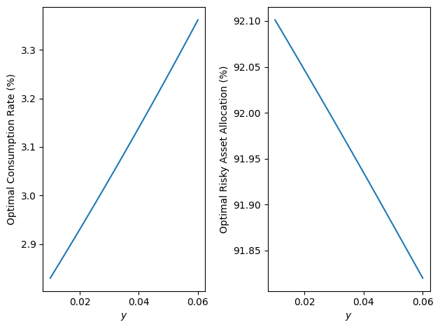

# Optimal Investment and Consumption in a Stochastic Factor Model

This repository implements the numerical scheme from Gutekunst, Herdegen, and Hobson [1] for computing the optimal investment and consumption policies in a stochastic factor model.

The risky asset $S$ and factor $Y$ follow 
$$
\begin{aligned}
    \frac{dS_t}{S_t} &= \left( r(Y_t) + \lambda(Y_t) \sigma(Y_t) \right) dt + \sigma(Y_t) dW_t, \\
    dY_t &= a(Y_t) dt + b(Y_t) d\tilde{W}_t
,\end{aligned}
$$ 
where $W$ and $\tilde{W}$ are Brownian motions with correlation $\rho$. 
The investor chooses the fraction $\Pi$ of wealth $X$ invested in the risky asset and the consumption-to-wealth rate $\Xi$ to maximise $$
V(x,y) = \sup_{(\Pi,\Xi)} \mathbb{E}\left[ \int_0^\infty \exp\left(-\int_0^t\delta(Y_s)ds\right) \frac{(\Xi_t X_t)^{1-R}}{1-R}dt \,\middle|\,X_0=x, Y_0=y \right]
.$$

The implementation is provided in [`optimal_consumption.py`](optimal_consumption.py).

## Example

For the Heston model, the optimal consumption rate and fraction of wealth invested in the risky asset can be computed as follows (see [`example.py`](example.py)):

```python
import numpy as np

import optimal_consumption as oc

R = 2
rho = -0.84


def delta(y):
    return np.full_like(y, 0.02)


def r(y):
    return np.full_like(y, 0.013)


def lmbda(y):
    return 1.66 * np.sqrt(y)


def sigma(y):
    return np.sqrt(y)


def a(y):
    return -0.088 * (y - 0.035)


def b(y):
    return 0.031 * np.sqrt(y)


grid, consumption_rate = oc.optimal_consumption_rate(
    R, r, delta, lmbda, rho, a, b, 1 / 10_000, np.sqrt(10_000), 10_000
)
investment_fraction = oc.optimal_investment_fraction(
    R, sigma, lmbda, rho, b, grid, consumption_rate
)
```



## Provided functions

- `optimal_consumption_rate` computes the optimal consumption-to-wealth rate
- `optimal_investment_fraction` computes the optimal risky-asset allocation
- `value_function` evaluates the power-utility value function for \(R\ne1\)
- `myopic_consumption_rate` and `myopic_investment_fraction` construct the
  corresponding myopic policies

The notebooks [`Heston.ipynb`](Heston.ipynb), [`Kim-Omberg.ipynb`](Kim-Omberg.ipynb), and [`Vasicek.ipynb`](Vasicek.ipynb) contain the code to generate the figures from [1].

## Reference

[1] Florian Gutekunst, Martin Herdegen, and David Hobson,
“[Optimal Investment and Consumption in a Stochastic Factor
Model](https://arxiv.org/abs/2509.09452),” arXiv:2509.09452 [q-fin.MF], 2025.
[doi:10.48550/arXiv.2509.09452](https://doi.org/10.48550/arXiv.2509.09452).
